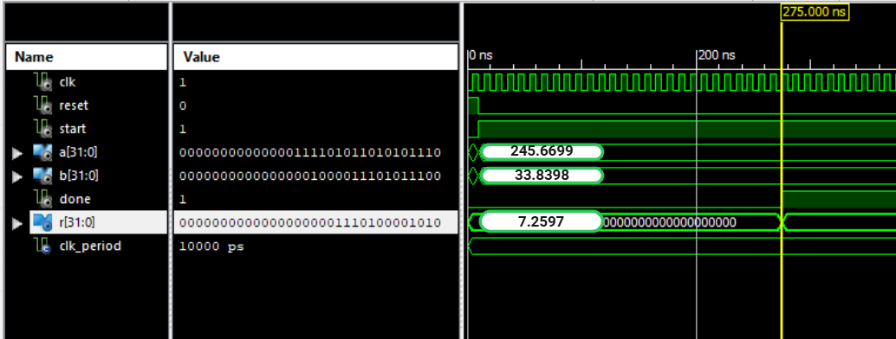

# Signed 32-bit Q22.10 Radix-4 Restoring Division in VHDL

This project implements a **signed fixed-point (Q22.10) 32-bit Radix-4 Restoring Division** in VHDL.  
The design processes **2 quotient bits per iteration**, supports **signed operands** in two's complement format, and outputs a signed quotient in the same fixed-point format.

---

## 🚀 Features
- **Data format**: Q22.10 fixed-point, signed
- **Algorithm**: Radix-4 restoring division (2 bits per iteration)
- **Bit width**: 32-bit inputs and outputs
- **Latency**: 27 cycles total (~270 ns at 100 MHz), including setup and result states.
- **Sign handling**: Two's complement support for signed division
- **Technology**: VHDL-93, synthesizable for FPGA

---

## ⚙ Technical Description
The design uses a **finite state machine (FSM)** with the following stages:

1. **RS** – Reset internal registers and outputs.
2. **Sleep** – Wait for `start` signal.
3. **Pro** – Resize inputs to 42 bits and shift the dividend left by 10 bits to match Q22.10 scaling.
4. **Inicio** – Adjust operand signs, applying two's complement if the number is negative.
5. **Reg** – Initialize concatenated dividend/quotient register (`AQ`) and store divisor in `M`.
6. **Op** – Perform Radix-4 restoring division, processing 2 quotient bits per iteration using intermediate subtract-and-restore steps.
7. **Res** – Apply final sign correction to the result and assert `done`.

The accumulator (`Acc`) and concatenated register (`AQ`) are extended to 42 and 84 bits respectively to handle fixed-point precision.

## 🖥 Simulation Waveform
Example simulation showing the division process and output timing.

sername>/radix4-division-vhdl.git
